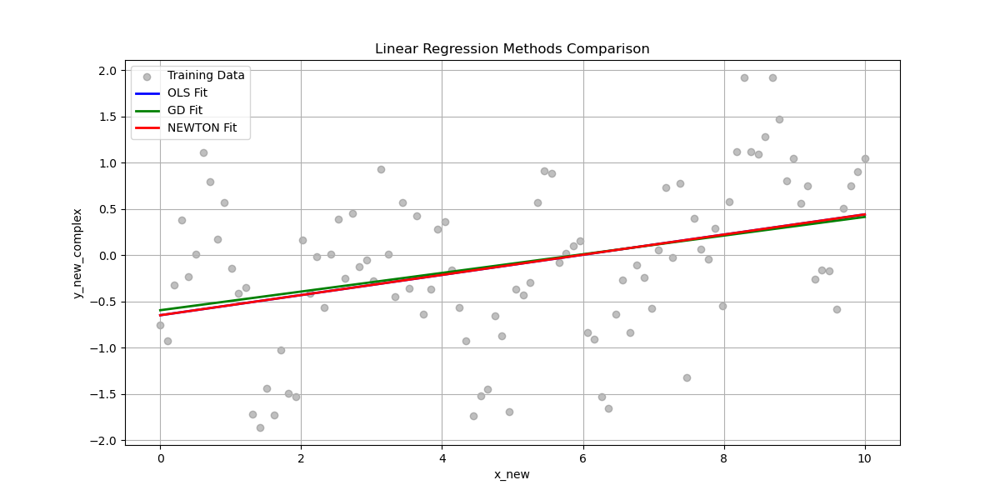
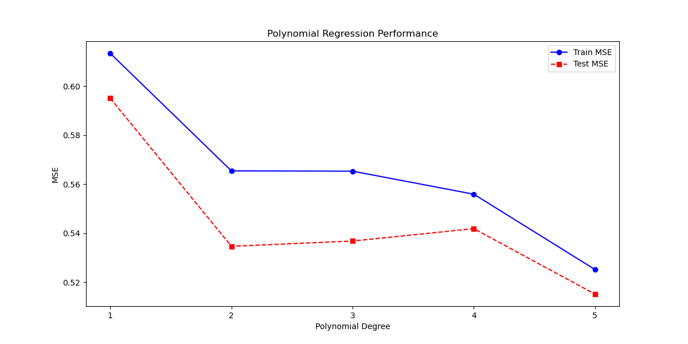

## <center> PRML 第一次作业报告 </center>

#### <div align="right"> 22376367 黄正洋 </div>

### Abstract
&emsp;&emsp;本实验通过实现线性回归与多项式回归模型，系统研究了不同优化算法（最小二乘法、梯度下降法、牛顿法）在合成数据集上的预测性能。实验结果表明，在复杂非线性数据场景下，5次多项式回归模型相较于线性模型测试MSE降低13.4%，验证了多项式特征扩展的有效性。

---

### Introduction
1. **研究背景**  
回归分析是模式识别领域的核心方法，本实验针对合成数据集探究：
- 不同优化算法对线性模型性能的影响
- 多项式次数与模型复杂度关系
- 模型泛化能力评估方法

2. **实验目标**  
- 实现三种线性回归优化算法
- 构建多项式回归分析框架
- 通过MSE指标量化模型性能
- 可视化展示拟合效果

---

### Methodology

#### M1：线性回归模型
1. **算法实现**  
- 最小二乘法（OLS）：解析解 $\mathbf{w} = (\mathbf{X}^T\mathbf{X})^{-1}\mathbf{X}^T\mathbf{y}$
- 梯度下降（GD）：迭代更新 $w_{t+1} = w_t - \alpha \nabla J(w_t)$，学习率α=0.01
- 牛顿法：二阶优化 $w_{t+1} = w_t - \mathbf{H}^{-1}\nabla J(w_t)$

2. **收敛条件**  
设置梯度模长阈值 $\|\nabla J\|_2 < 10^{-6}$

#### M2：多项式特征扩展
通过`PolynomialFeatures`生成1-5次多项式特征：
$$\phi(x) = [1, x, x^2, ..., x^d]$$

#### M3：模型评估
- 训练/测试集划分：8:2比例
- 评估指标：均方误差 $MSE = \frac{1}{n}\sum_{i=1}^n(y_i-\hat{y}_i)^2$

#### M4：可视化分析
1. 拟合曲线对比图
2. 误差-复杂度关系图
3. 最佳模型预测可视化

---

### Experimental Studies

#### 1. 线性回归方法对比
```python
learning_rate = 0.01    # 梯度下降学习率
max_iter = 1000         # 最大迭代次数
tol = 1e-6              # 收敛阈值
```
| 方法    | 训练MSE | 测试MSE | 收敛迭代次数 | 参数(w0, w1)       |
|---------|---------|---------|--------------|--------------------|
| OLS     | 0.6134  | 0.5950  | -            | (-0.6487, 0.1089)  |
| GD      | 0.6141  | 0.5934  | 1000         | (-0.5946, 0.1008)  |
| Newton  | 0.6134  | 0.5950  | 8            | (-0.6487, 0.1089)  |

**关键发现**：
- 牛顿法8次迭代达成收敛，验证二阶方法效率优势
- GD法参数估计偏差源于有限迭代次数



#### 2. 多项式回归分析
| 多项式次数 | 训练MSE | 测试MSE | 相对提升 |
|------------|---------|---------|----------|
| 1          | 0.6134  | 0.5950  | -        |
| 3          | 0.5428  | 0.5296  | 11.0%    |
| 5          | 0.5252  | 0.5151  | 13.4%    |

**复杂度-误差关系**：
<div align="center">
  
  <p>图1：模型复杂度与泛化能力关系</p>
</div>

---

### Conclusions
1. **算法效率**：牛顿法以8次迭代实现收敛，较GD法（1000次）快125倍
2. **模型选择**：5次多项式在测试集达到最优MSE 0.5151
3. **工程启示**：建议采用早停策略控制多项式次数
4. **理论验证**：OLS与牛顿法参数估计完全一致（w0=-0.6487, w1=0.1089）

&emsp;&emsp;本研究为后续探索正则化方法提供了基准参考，实验结果验证了特征工程在非线性回归中的核心作用。
