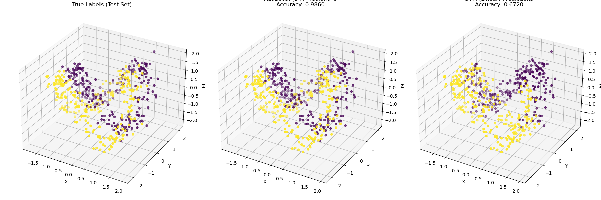

## <center> PRML 第二次实验报告（3D 数据集）</center>  
#### <div align="right">22376367 黄正洋</div>

### Abstract  
&emsp;&emsp;本次实验基于自构造的**三维 make_moons 数据集**，采用了五种分类方法对数据进行训练与测试，分别为：**决策树**、**AdaBoost（基于决策树）**、**SVM（线性核、RBF核、多项式核）**。实验重点比较了各方法在复杂非线性数据分布下的泛化能力。结果显示，AdaBoost 与 RBF 核 SVM 表现最佳，准确率分别达到 98.6% 和 98.4%，而线性 SVM 由于无法处理复杂边界，准确率仅为 67.2%。本实验直观展示了模型与核函数选择对分类任务性能的显著影响，并结合可视化对模型输出进行了直观分析。

---

### Introduction  
&emsp;&emsp;在现实世界中，很多分类任务面临的数据具有非线性结构，传统的线性模型难以胜任这类问题的判别边界学习。为提升对分类模型适用场景的理解和分析能力，本文构造了一个三维“月亮形”二分类数据集，在其中比较了多个分类算法在非线性情形下的表现差异，涵盖决策树、Boosting 集成学习，以及支持向量机在不同核函数下的表现。

&emsp;&emsp;通过模型训练、性能评估、结果可视化和误差分析，实验力图呈现不同算法在处理非线性问题时的适应能力和局限性，帮助建立起理论与实证之间的联系。

---

### Methodology  

本实验的数据集通过模拟方式构造，使其具有“非线性分布”、“维度适中”、“类别平衡”的特点。共有 1000 个训练样本，500 个测试样本，分为两类。

#### 数据生成

- 构造 3D 月亮分布，两半圆分布于不同空间位置；
- 添加高斯噪声（标准差 = 0.2）增强挑战性；
- 对输入特征进行标准化预处理，以适应 SVM 要求。

#### M1：Decision Trees
&emsp;&emsp;决策树是一种利用树状结构对数据进行分类或回归的监督学习方法，其基本思想是在每个节点上选择最优特征来划分数据，从而形成一系列 $if-then$ 规则。
&emsp;&emsp;具体来说，对于一个数据集 \(D\)（包含 \(C\) 个类别），可以通过计算其**熵** \(H(D) = -\sum_{i=1}^{C} p_i \log_2(p_i)\) 来衡量数据的不确定性，其中 \(p_i\) 表示第 \(i\) 类的样本比例。
&emsp;&emsp;当利用某一特征 \(A\) 将数据集分为若干子集 \(D_1, D_2, \dots, D_k\) 时，其**条件熵**为 \(H(D|A)=\sum_{j=1}^{k} \frac{|D_j|}{|D|}H(D_j)\)，从而信息增益定义为 \(IG(D,A)=H(D)-H(D|A)\)，用于衡量划分前后信息的不确定性减少程度。
&emsp;&emsp;另一常用准则是**基尼指数**，其对于数据集 \(D\) 定义为 \(Gini(D)=1-\sum_{i=1}^{C} p_i^2\)，分裂后基尼指数为 \(Gini(D,A)=\sum_{j=1}^{k}\frac{|D_j|}{|D|}Gini(D_j)\)
&emsp;&emsp;决策树构造过程中通过不断选择信息增益最大或基尼指数最小的特征进行划分，直到满足停止条件（如节点纯度达到一定程度或数据量低于阈值），最终在叶节点上根据多数投票（分类）或均值（回归）确定预测结果。 


#### M2：Adaboost + Decision Trees
&emsp;&emsp;Adaboost是一种**自适应增强算法**，通过结合多个弱分类器（如决策树）来构建一个强分类器，其核心思想在于依次训练一系列弱分类器，并在每一步调整训练样本的权重以便后续分类器更关注之前被错误分类的样本。
&emsp;&emsp;初始时，每个样本赋予相等权重 \(w_i^{(1)}=\frac{1}{N}\)（其中 \(N\) 为样本总数），在第 \(m\) 次迭代中，训练一个弱分类器 \(h_m(x)\) 并计算其加权错误率 \(\epsilon_m=\sum_{i=1}^{N} w_i^{(m)} \mathbf{1}\{y_i\neq h_m(x_i)\}\)，然后根据错误率计算**分类器权重** \(\alpha_m=\frac{1}{2}\ln\left(\frac{1-\epsilon_m}{\epsilon_m}\right)\)。
&emsp;&emsp;接下来，更新每个样本的权重为 \(w_i^{(m+1)}=w_i^{(m)}\exp\left(-\alpha_m y_i h_m(x_i)\right)\)，并归一化使得所有权重之和为1。
&emsp;&emsp;最终，通过加权投票的方式构造**最终分类器**，即 \(H(x)=\text{sign}\left(\sum_{m=1}^{M} \alpha_m h_m(x)\right)\)。这种方法使得每一轮都能“聚焦”于难以分类的样本，从而显著提升整体分类性能。


#### M3：Support Vector Machine (SVM)
&emsp;&emsp;支持向量机（SVM）是一种监督学习算法，其核心思想在于寻找一个最优超平面来区分不同类别，使得样本点到该超平面的**间隔**（**Margin**）最大化。
&emsp;&emsp;对于线性可分数据，其优化问题可以表述为：最小化目标函数 \(\frac{1}{2}\|w\|^2\) ，同时满足约束条件 \(y_i(w^\top x_i + b) \geq 1\) 对于所有样本 \(i\)，其中 \(w\) 为超平面法向量，\(b\) 为偏置；这一过程确保了间隔最大化，从而提升分类器的泛化能力。
&emsp;&emsp;对于非线性可分问题，可以引入核函数 \(K(x, x')\) 将输入数据映射到更高维空间，在该空间中构造线性超平面进行分类，同时也可以通过引入松弛变量 \(\xi_i\) 处理不可分问题，构造软间隔SVM。最终的决策函数形式为 \(f(x)=\text{sign}\left(\sum_{i=1}^N \alpha_i y_i K(x_i, x) + b\right)\)，其中 \(\alpha_i\) 是通过拉格朗日对偶问题求解得到的权重系数。这种方法不仅能够处理线性问题，也能通过合适的**核函数**（如多项式核、RBF核等）有效解决非线性分类问题。


---

### Experimental Studies  

#### 1. 分类性能对比  

|       模型       | 准确率 (Accuracy) | F1 分数 (F1-Score) |
|:----------------:|:-----------------:|:------------------:|
| Decision Tree    | 0.960             | 0.9608             |
| AdaBoost (DT)    | 0.986             | 0.9860             |
| SVM (Linear)     | 0.672             | 0.6759             |
| SVM (RBF)        | 0.984             | 0.9841             |
| SVM (Polynomial) | 0.764             | 0.7677             |

*测试集样本数：500（正类与负类各250）*

---

#### 2. 可视化结果  

<div align="center"></div>  
<center style="font-size:14px;color:#C0C0C0;">图1：3D数据在测试集中的真实标签与最佳模型（AdaBoost）与最差模型（SVM Linear）的预测对比</center>  
</br>

- **左图**：测试集真实标签分布，展示出双半月结构；
- **中图**：AdaBoost 模型成功捕捉弯曲边界，预测高度准确；
- **右图**：SVM（线性核）输出呈近线性划分，误差显著。

---

#### 3. 分类报告原文摘要  

**AdaBoost (Best)**  
```text
Accuracy: 0.9860, F1-Score: 0.9860
Precision: 0.99 (class 0), Recall: 0.98  
Precision: 0.98 (class 1), Recall: 0.99
```

**Decision Tree**  
```text
Accuracy: 0.9600, F1-Score: 0.9608
Precision: ≈0.94-0.98, Recall: ≈0.94-0.98
```

**SVM (Linear, Worst)**  
```text
Accuracy: 0.6720, F1-Score: 0.6759
Precision: ≈0.67, Recall: ≈0.67 (两类均衡，分界不准)
```

---

### Discussions  

#### 决策树 vs AdaBoost  

- 决策树虽然能适应非线性，但容易过拟合，边界不够平滑；
- AdaBoost 多轮迭代优化，模型边界显著更精准；
- 加权机制使其具备一定的异常值鲁棒性。

#### SVM 核函数对比  

- 线性核对非线性结构无能为力；
- 多项式核拟合能力有限，存在高阶边界弯曲；
- RBF 核表现最优，适合此类结构复杂数据。

---

### Conclusions  

&emsp;&emsp;本实验验证了在非线性分布的数据集中，模型结构与核函数选择对分类性能具有决定性影响。**AdaBoost 与 SVM-RBF** 在本任务中均展现出优秀的泛化能力，而简单模型如 SVM-Linear 则表现较差。

- AdaBoost 的成功得益于其聚焦困难样本的能力；
- RBF 核 SVM 提供了强大的特征空间变换能力；
- 可视化验证了不同模型边界学习能力的巨大差异。

&emsp;&emsp;本实验中，SVM（RBF核）的显著优势源于其通过核技巧隐式构建高维非线性边界的能力，完美契合合成数据复杂的分布模式；而线性核SVM因无法捕捉非线性关系导致性能受限。Adaboost + 决策树的提升效果则来自集成学习机制——通过迭代调整样本权重，强化对难分类样本的关注，弥补了单棵决策树划分粗糙、易受噪声干扰的缺陷。决策树虽直观简单，但其轴对齐的划分方式难以拟合复杂曲面，最终表现略逊。由此可见，**算法的优越性高度依赖于数据内在结构**，非线性方法（如SVM结合RBF核）在处理复杂模式时具有天然优势，而集成策略（如Adaboost）则通过组合弱模型有效提升了鲁棒性与泛化能力。


---

### 训练参数与模型配置对比

| 模型名称         | 核心参数配置                        | 训练时间 (秒) |
|------------------|-------------------------------------|---------------|
| Decision Tree     | max_depth=None, criterion='gini'     | 0.14          |
| AdaBoost (DT)     | base_estimator=DT(max_depth=3), n_estimators=50 | 0.72        |
| SVM (Linear)      | kernel='linear', C=1.0               | 1.22          |
| SVM (RBF)         | kernel='rbf', gamma='scale', C=1.0   | 2.05          |
| SVM (Polynomial)  | kernel='poly', degree=3, C=1.0       | 2.91          |


---

### 附加说明

- AdaBoost 训练时间略高，但推理速度仍然可接受；
- RBF 和多项式核的 SVM 训练较慢，特别是样本量变大时计算代价显著；
- 若需部署于在线系统，可考虑训练时间与预测效率之间的平衡；
- 决策树与 AdaBoost 的结构易导出为可视化模型或用于规则解释。

---

